Updated Sep 18 2019

# Lab 100: Setting Up Your DevCS
Note: If DevCS has already been provisioned and set up with link to OCI you can skip to lab 200.

## Introduction
 In this lab we will learn how to configure our DevCS environment.

## Objectives:
- Have a functioning Repository
- Understand the CONFIG file
- Have an understanding of the general DevCS tools we will be using.

Required Artifacts
------------------

-   The following lab requires an Oracle Cloud account. You may use your own cloud account, a cloud account that you obtained through a trial, or a training account whose details were given to you by an Oracle instructor.
- A pre-provisioned OIC instance and developer rights within the instance.
- Access to your OCI Account
- A service account for OIC instance that allows us to run APIs against the environment.
- A service account for DevCS
- An understanding of all the OIC artifacts. (Processes, Integrations, Connections, Packages, etc...)

Part 1. Entering DevCS Environment
====================================

### STEP 1: Sign in to Oracle Cloud

 Go to [cloud.oracle.com](https://cloud.oracle.com/), click **Sign In** to sign in with your Oracle Cloud account.

 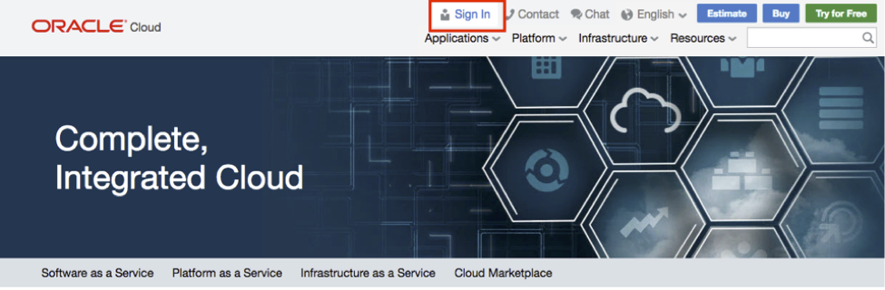

 Enter your **Cloud Account Name** and click next.

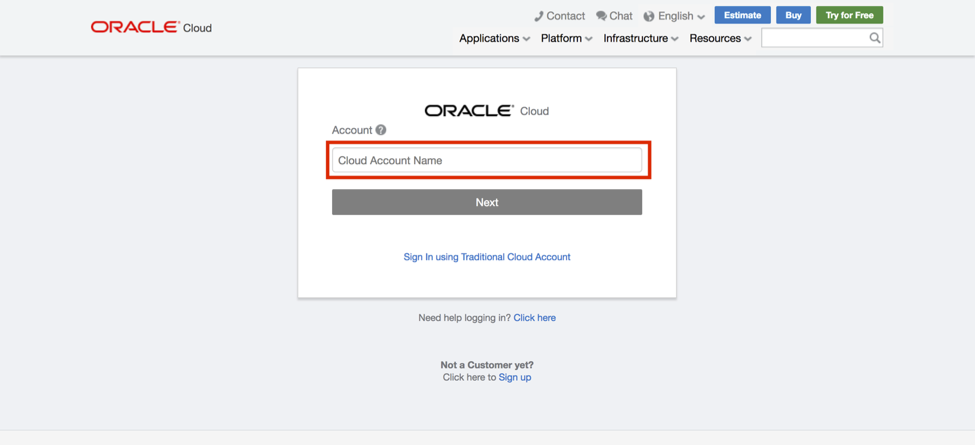

 Enter your Oracle Cloud **username** and **password**, and click **Sign In**.

### STEP 2: Navigate to DevCS
Next we will navigate to our DevCS instance by clicking on the hamburger menu on the too left, expanding our services tab and clicking on developer.
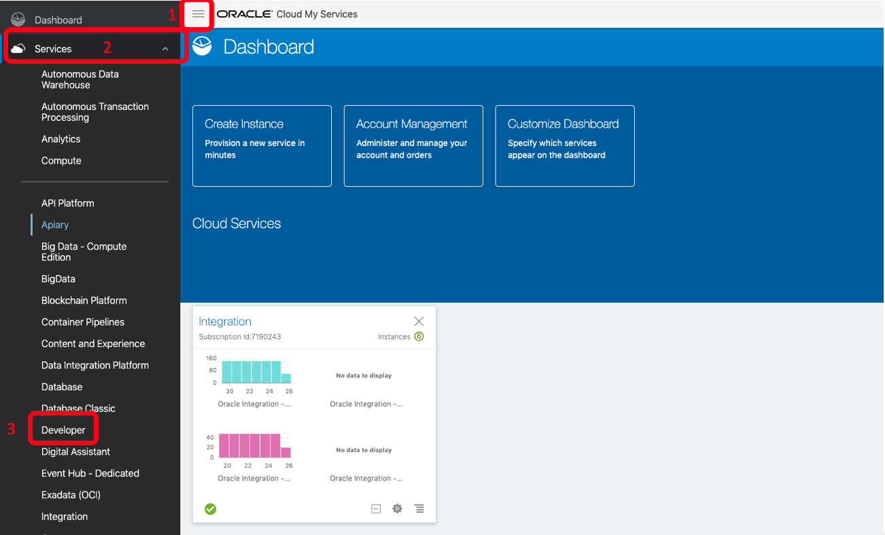

From this page we will click on the hamburger menu for your particular instance and click on Access Service Instance. This will lead us directly to our DevCS page.
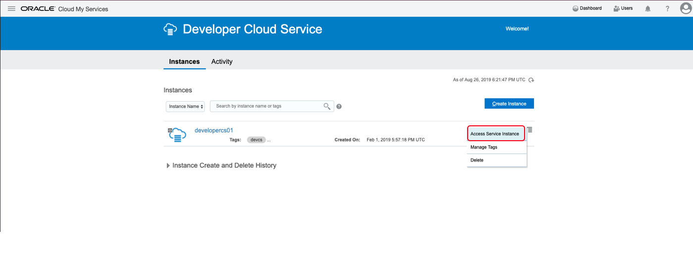

### STEP 3: Setting up our DevCS
Once we are in DevCS we will connect to our OCI Account and spin up our virtual machine that we will use to run our build scripts. First click on **OCI Account** tab on the top of our DevCS screen.
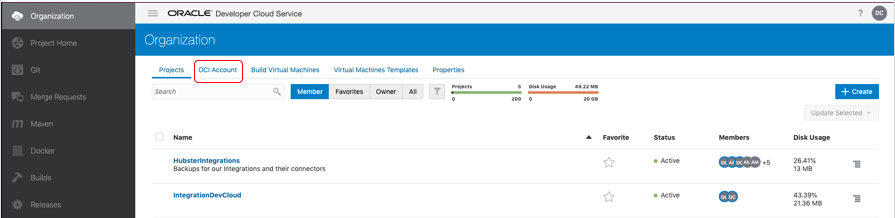

From here we will need to fill in the following information:

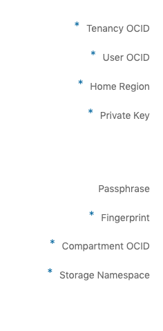

Next we are going to create our Virtual Machine Template. Go to the Virtaul Machine Templates tab and click on **Create Template**. 

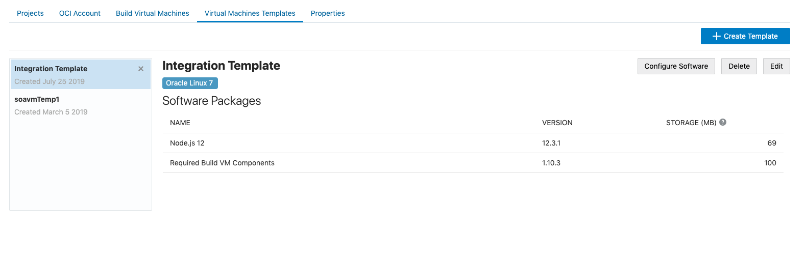

From here fill in the Name and choose your platform as Oracle Linux 7. 

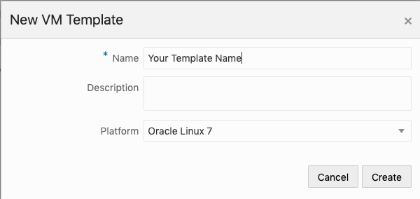

Give the description of Integration Pipeline Virtual Machine Template, and click **Create**

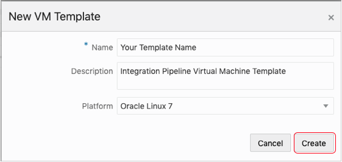

Now, we will configure the Template's software. The software we choose here is software that will exist on the VM we will provision.

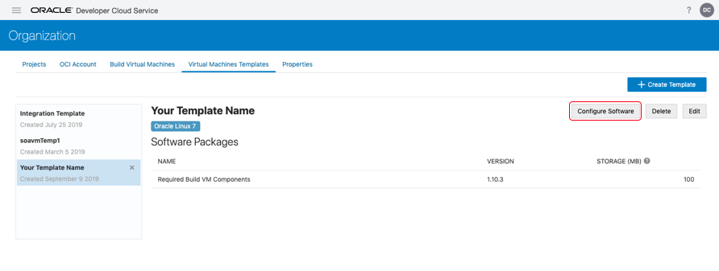

We will add **Node.js 12** so that we can use node in our scripts to parse through our JSONs returned from our API calls to our integration environment.

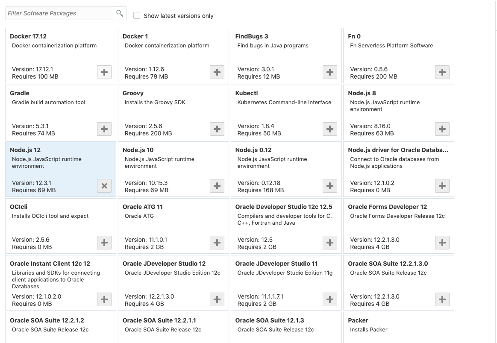

Now we get to do our last setup piece for DevCS. We are going to create and spin up our Virtual Machine. Click on the **Build Virtual Machine** tab at the top.

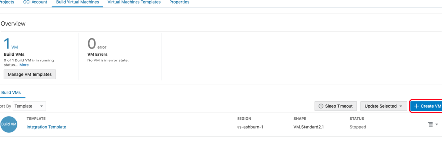

Click on **Create VM**

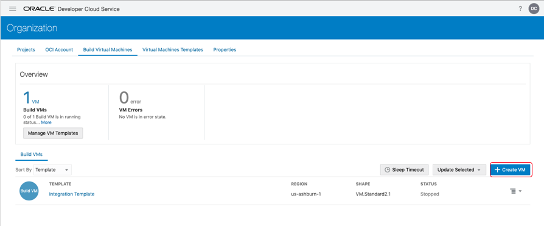

From here choose the template you have just created your desired region and VM.Standard1.1. This is a small shape because we only need it to run simple shell scripts.

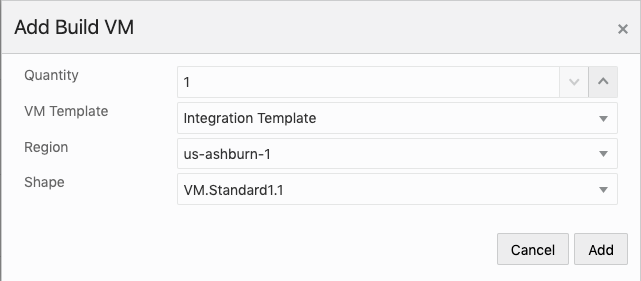

Once Created Click the Hamburger menu to the right of your VM and click **Start**.

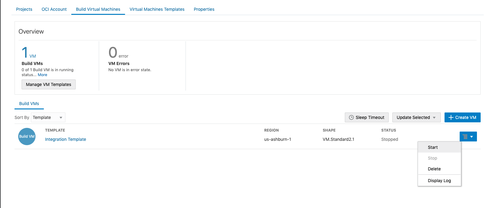

You have now completed Lab100! Lets move on to lab 200 and get started with using our DevCS!