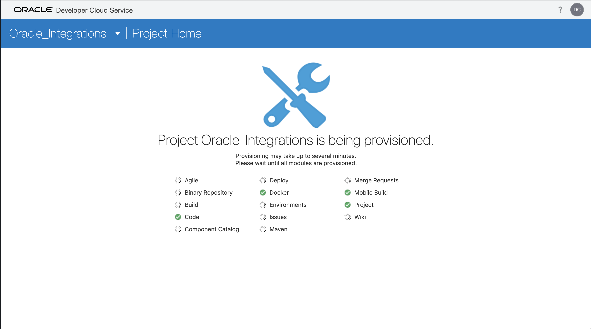
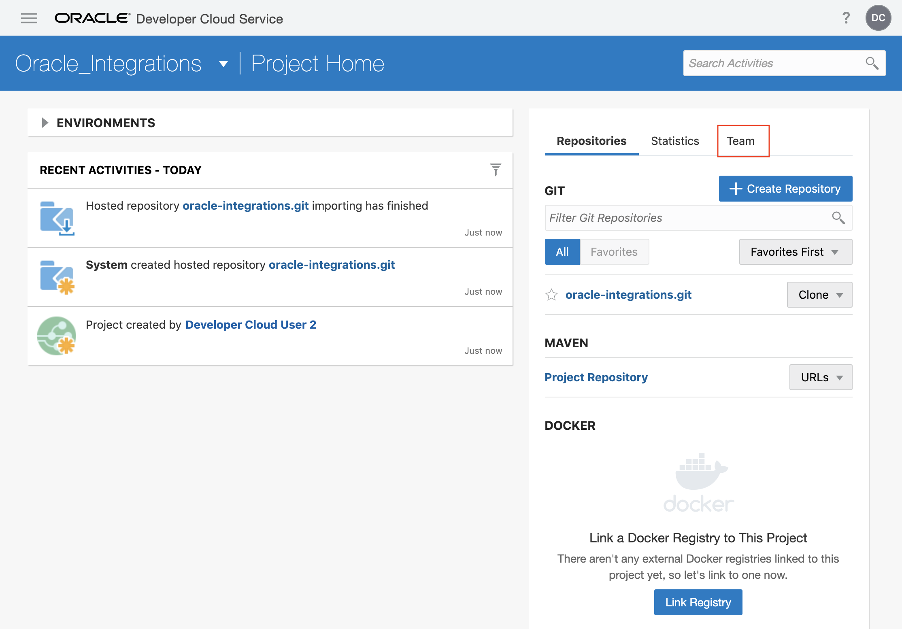
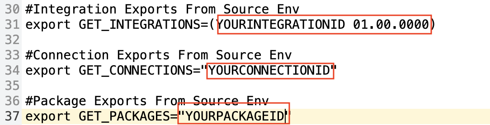
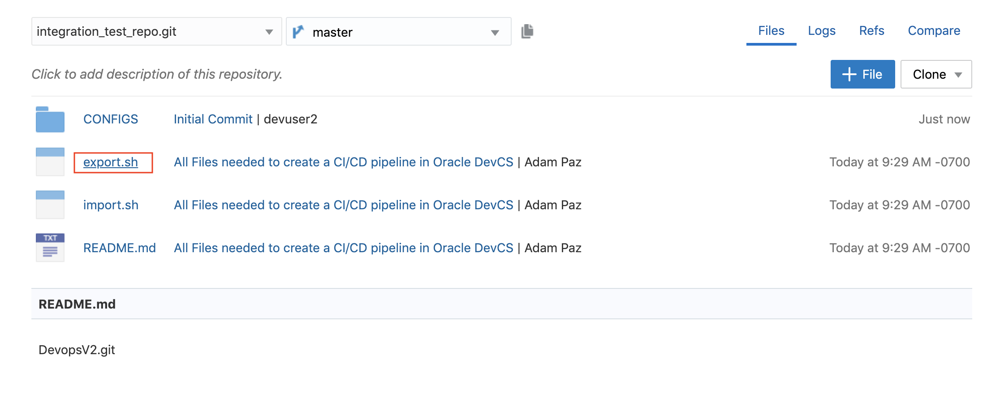
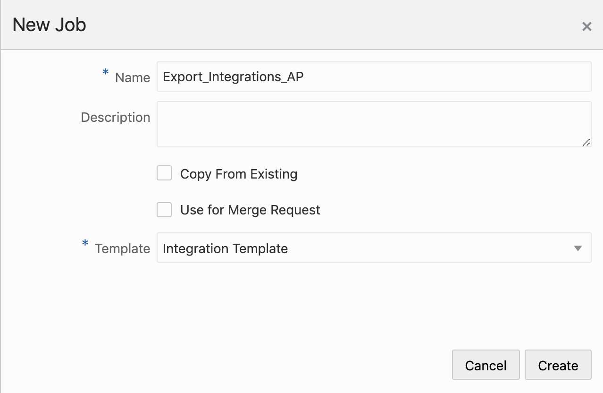
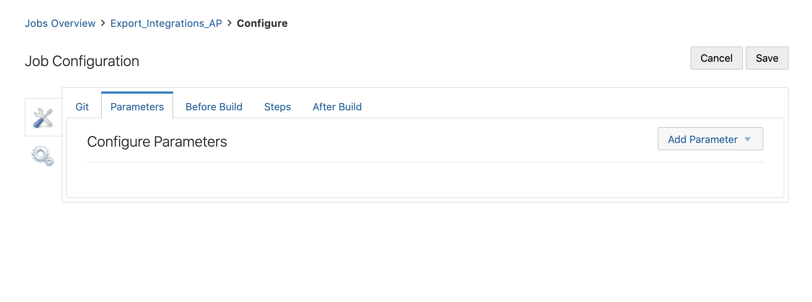
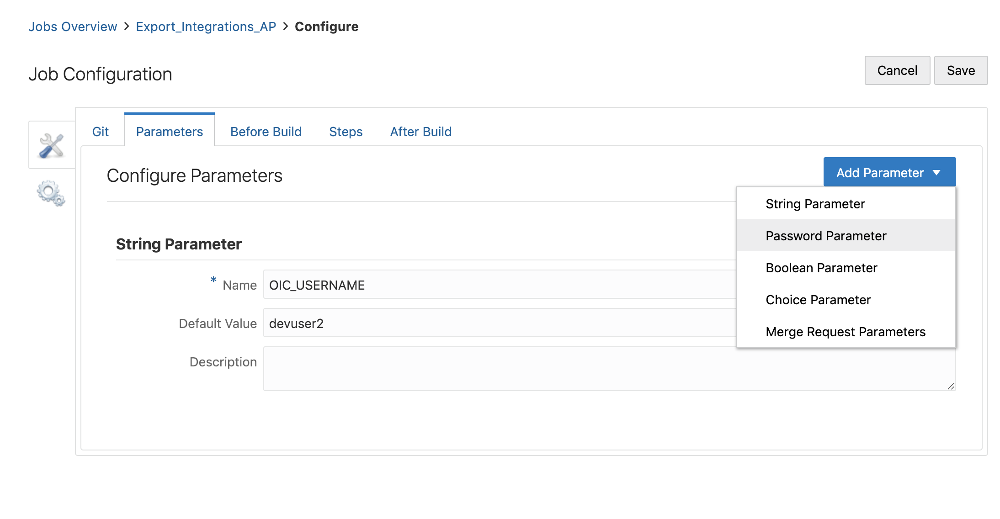
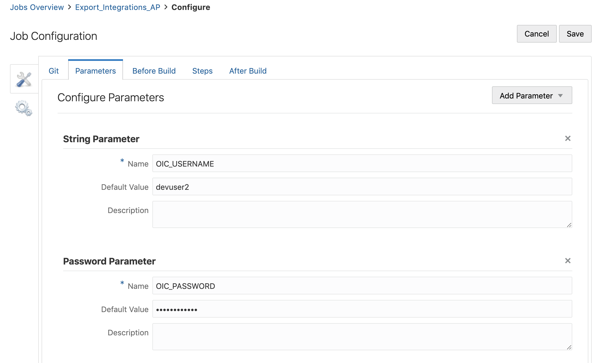
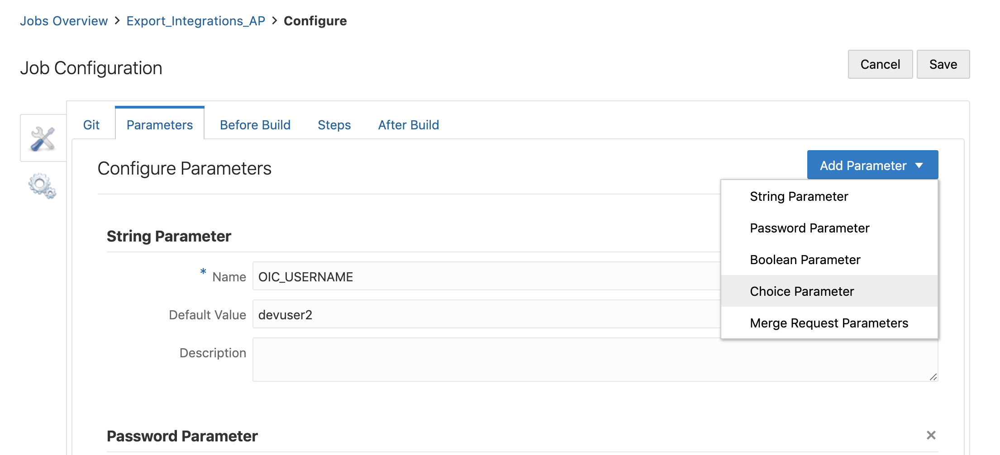
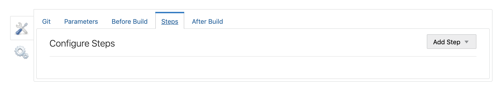

Updated Sep 18 2019

# Lab 200: Configuring Your DevCS

## Introduction
 In this lab we will be configuring our DevCS environment to have the repositories we need. A

## Objectives:

- Clone a github repository into DevCS 

- Set up our builds for integration exportation

------------------

Steps
-----

### STEP 1: Creating our Project
The first thing we are going to do here is, creating our project. In the Projects tab of DevCS click on the **+Create** button in the top right. 

The New Project screen will come up and we will add our information for our project. Name this what you'd like, I named it Oracle_Integrations and add any description you'd like. You can make this a private project to control who has access to it. Click **next**.

We will initialize our project with a repository. 

For the repository import an existing repository and use the url: 
https://github.com/adam-paz/IntegrationCICDLab.git

You will then get a screen while your project gets provisioned. This will take just a few moments.

You will automatically be taken to our new project screen. On the right hand side you should see an initial repository. If one does not show up, clear the filter on the right by clicking the X. 

### STEP 2: setting up our repository
#### Note: If you have multiple people working on this lab simulatenously this is where we can start to split the work. 

By clicking on the **team** tab you will be able to add and remove users from your project. 

*Note: If there are mulptiple people following this lab add all of these users here now.*

Now we will go back to our repositories tab.

This is where you can create more repositories for your project. I recommend using a new repository for each OIC asset/project you want to export. So we will clone this initial repository and use it as our base for future repositories. So first click **clone** and click the copy button. Then click **+ Create Repository**.

Name your repository what you'd like, (include initials to differentiate your repository,) and add any description you see fit and select import existing repository. Past the repository link we had just copied. Input your username and pw for the current DevCS account. (SSO will make this a bit trickier.)

This should land us right inside of our new git repo. If it does not navigate to git on the nav bar on the left. From here enter our **CONFIGS** folder.

For the purposes of this lab we will only be editing our env-DEV configuration file, so click on **env-DEV**.

### STEP 3: Editing our config file

Next click on the **pencil** in the top right to edit our config file.

We have 2 sections a TARGET and a SOURCE section. Each variable within the TARGET section is for importing integration artifacts into your integration environment. Each variable in our SOURCE section is for exporting from our OIC environment into our repository. 

The first thing we need to edit is our **OIC_HOST_NAME**, replace this with your OIC host name which can be found in the url from your OIC environment up to the .com. 

ex. _yourintegrationenv-yourcloudacc.integration.ocp.oraclecloud.com_

Next scroll down to the source section, for now we will only be exporting integrations. Here you can include your integration IDs, connection IDs and package names depending on what you'd like to export.

#### IMPORTANT

**If all of the integrations you want to pull are contained in a package you can export all of them and all connectors associated by exporting the package. This is called a full refresh. However, we have the option here to pull down specific integrations and connections for when we edit only smaller pieces of our full project or asset and don't want to be doing full refreshes every time.**

 Follow the image below for formatting. 

You can find your Integration and Connection IDs by hitting the info button on the specific integration or connection. 

Next click **commit** in the top right and add any commit messages and details you'd like.

Well done now all we have to do is set up our build.
### STEP 4: Setting up our export build
For the purpose of this lab we will only be setting up the export build but the import works in the same way. All you need to do is create a secondary build called import and copy your import.sh file into it as we will be doing with export.sh. Enter our **export.sh**.

As you can see at the top of the build it tells us what parameters to add to our build. Take not of these. Once inside click on the **pencil** icon.

Copy all of the code within the export.sh script.

Next navigate to our builds section on the left nav-bar and click **+ Create Job**.

Name your build export or export_integrations. The name doesn't matter but if there are multiple people following this lab name your export script with your initials at the end as I have added AP to the end of mine below. Click **Create**.

Once inside of your build we see we are on the git tab. Here click **Add Git**. Once git has been added choose your repository and keep the branch pointing to master. The reason we choose a repository and branch here is it allows our build to access our specified repo. Meaning we export artifacts from our integration environment to the speicified repo. And for importing we import artifacts from our repo to our Integration environment.

Next we will add our parameters. We will be adding the parameters specified at the top of our shell script.

First we will add a string Parameter for our OIC_USERNAME

Then we will add a password Parameter for our OIC_PASSWORD

You may add default values if you would like to make your testing process quicker.

And lastly we will be adding a choice parameter for our OIC_SOURCE_ENV

As you can see the 3 choices for our parameter correspond to our 3 different oic environment configuration files. When running our build we can choose which environment we want our build to point to.

Next we will click on the **Steps** tab.

From here click **Add Step** and choose **Unix Shell**.

Inside of our Unix Shell paste the shell script copied previously from our export.sh and click **Save**

Our build is now set up and ready to be run, you can do the same with your import script and your target variables in your environment configuration file if you would like.

Otherwise continue on to lab 300 for a deeper understanding of our Unix Shell script. 

If you do not want to go through the script right now then you are done! Congratulations you are now ready to configure your CICD pipeline and test the current one out! Good Luck!